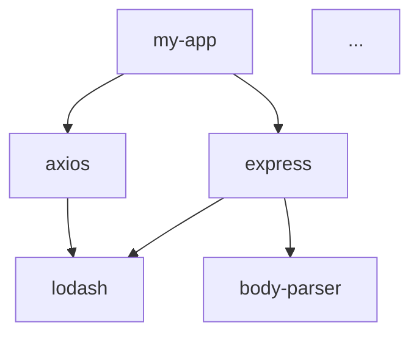

<!--
Copyright (c) 2024 Gibson Powers Contributors

SPDX-License-Identifier: GPL-3.0
-->

# Prompt: SBOM Dependency Graph Analysis

## Purpose
Analyze the dependency structure in an SBOM to understand relationships, identify risks, and optimize the dependency tree.

## When to Use
- Understanding transitive dependency chains
- Identifying outdated packages
- Detecting circular dependencies
- Assessing dependency bloat
- Planning dependency updates
- Supply chain risk assessment

## Prompt

```
Please analyze the dependency graph in this SBOM:

1. Build a complete dependency tree visualization
2. Identify:
   - Direct vs. transitive dependencies
   - Dependency depth (longest chain)
   - Most depended-upon packages (centrality)
   - Outdated packages with available updates
   - Circular dependencies
   - Deprecated packages
3. For each major component:
   - List its transitive dependencies
   - Identify vulnerabilities in the dependency chain
   - Calculate "blast radius" (impact if compromised)
4. Provide recommendations for:
   - Reducing dependency count
   - Updating outdated packages
   - Removing unnecessary dependencies
   - Breaking circular dependencies

[Paste SBOM content here]
```

## Expected Output
- Dependency tree visualization (Mermaid diagram)
- Direct and transitive dependency breakdown
- Outdated package table with current vs. latest versions
- Circular dependency detection
- Risk analysis based on dependency position
- Optimization recommendations

## Variations

### Transitive Dependency Deep Dive
```
Focus on transitive (indirect) dependencies in this SBOM.
For each direct dependency, show its full transitive tree.
Highlight any transitive dependencies with vulnerabilities.

[Paste SBOM]
```

### Outdated Package Report
```
Identify all outdated packages in this SBOM.
Provide a table with:
- Package name
- Current version
- Latest stable version
- Age of current version
- Breaking changes in upgrade path

[Paste SBOM]
```

### Dependency Optimization
```
Analyze this SBOM for dependency optimization opportunities:
- Duplicate dependencies (different versions of same package)
- Packages that could be removed
- Alternative packages with fewer dependencies
- Consolidation opportunities

[Paste SBOM]
```

### Supply Chain Risk Assessment
```
Assess supply chain risk based on the dependency graph:
- Single points of failure (critical dependencies)
- Packages with low maintenance activity
- Abandoned or deprecated packages
- Dependencies from untrusted sources
- Package popularity and community health

[Paste SBOM]
```

## Examples

### Example Usage
```
Please analyze the dependency graph in this SBOM...

[CycloneDX SBOM with complex dependencies]
```

### Example Output Structure
```markdown
# Dependency Analysis Report

## Dependency Overview
- Direct Dependencies: 15
- Transitive Dependencies: 145
- Total Unique Packages: 160
- Maximum Dependency Depth: 7 levels
- Circular Dependencies: 2

## Dependency Tree



## Most Critical Dependencies
| Package | Dependent Count | Vulnerability Count |
|---------|----------------|---------------------|
| lodash | 23 | 2 |
| minimist | 15 | 1 |
| semver | 12 | 0 |

## Outdated Packages
| Package | Current | Latest | Age (months) |
|---------|---------|--------|--------------|
| express | 4.17.1 | 4.19.2 | 36 |
| axios | 0.21.1 | 1.7.7 | 40 |

## Recommendations
[Specific actions...]
```

## Tips
- Request specific visualization formats (Mermaid, DOT, etc.)
- Specify depth limits for very large dependency trees
- Mention ecosystem constraints (npm, Maven, etc.)
- Include maintenance windows for breaking changes
