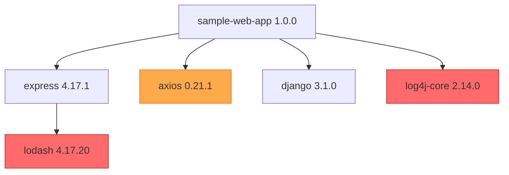

<!--
Copyright (c) 2025 Crash Override Inc. - https://crashoverride.com

SPDX-License-Identifier: GPL-3.0
-->

# SBOM Analysis Report

**Application**: sample-web-app v1.0.0
**SBOM Format**: CycloneDX 1.7
**Analysis Date**: 2024-11-20
**Analyst**: SBOM Analyser Skill

## Executive Summary

**Total Components**: 5
**Direct Dependencies**: 4
**Transitive Dependencies**: 1
**Critical Vulnerabilities**: 2
**High Vulnerabilities**: 3
**Medium Vulnerabilities**: 1
**CISA KEV Matches**: 1

### Key Findings

🔴 **CRITICAL**: Log4Shell vulnerability (CVE-2021-44228) detected in log4j-core 2.14.0 - **ACTIVELY EXPLOITED** (CISA KEV)
🔴 **CRITICAL**: Command injection in lodash < 4.17.21 (CVE-2021-23337)
🟠 **HIGH**: Multiple vulnerabilities in axios 0.21.1
🟠 **HIGH**: Prototype pollution in lodash (CVE-2020-28500)

**Immediate Action Required**: Upgrade log4j-core and lodash to remediate critical, exploited vulnerabilities.

## Vulnerability Details

### Critical Vulnerabilities

#### 1. CVE-2021-44228 - Apache Log4j Remote Code Execution (Log4Shell)

**Component**: log4j-core 2.14.0
**CVSS Score**: 10.0 (Critical)
**CWE**: CWE-502 (Deserialization of Untrusted Data)
**CISA KEV**: ⚠️ **YES - Known Exploitation**
**Ransomware**: Associated with ransomware campaigns

**Description**:
Apache Log4j2 <=2.14.1 JNDI features do not protect against attacker-controlled LDAP and other JNDI related endpoints. An attacker who can control log messages or log message parameters can execute arbitrary code loaded from LDAP servers when message lookup substitution is enabled.

**Impact**:
- Remote code execution
- Complete system compromise
- Data exfiltration
- Lateral movement

**Remediation**:
```
Upgrade to log4j-core >= 2.17.1
```

**References**:
- https://nvd.nist.gov/vuln/detail/CVE-2021-44228
- https://www.cisa.gov/known-exploited-vulnerabilities-catalog
- https://logging.apache.org/log4j/2.x/security.html

**Priority**: **IMMEDIATE** (CISA KEV - known exploitation)

---

#### 2. CVE-2021-23337 - Lodash Command Injection

**Component**: lodash 4.17.20
**CVSS Score**: 9.8 (Critical)
**CWE**: CWE-78 (OS Command Injection)
**CISA KEV**: No

**Description**:
Command injection vulnerability in lodash versions prior to 4.17.21 via the template function.

**Impact**:
- Arbitrary command execution
- Server compromise
- Data theft

**Remediation**:
```
Upgrade to lodash >= 4.17.21
```

**References**:
- https://nvd.nist.gov/vuln/detail/CVE-2021-23337
- https://github.com/advisories/GHSA-35jh-r3h4-6jhm

**Priority**: **HIGH**

### High Vulnerabilities

#### 3. CVE-2021-3749 - Axios Sensitive Data Exposure

**Component**: axios 0.21.1
**CVSS Score**: 7.5 (High)
**CWE**: CWE-200 (Exposure of Sensitive Information)

**Description**:
axios before 0.21.2 allows attackers to cause a denial of service or possibly have unspecified other impact by sending invalid Content-Length headers.

**Remediation**:
```
Upgrade to axios >= 0.21.2
```

**References**:
- https://nvd.nist.gov/vuln/detail/CVE-2021-3749

**Priority**: **MEDIUM**

---

#### 4. CVE-2020-28500 - Lodash Prototype Pollution

**Component**: lodash 4.17.20
**CVSS Score**: 7.4 (High)
**CWE**: CWE-1321 (Prototype Pollution)

**Description**:
All versions of package lodash prior to 4.17.21 are vulnerable to Prototype Pollution via the setWith function.

**Impact**:
- Application logic bypass
- Potential remote code execution depending on usage

**Remediation**:
```
Upgrade to lodash >= 4.17.21
```

**References**:
- https://nvd.nist.gov/vuln/detail/CVE-2020-28500

**Priority**: **MEDIUM**

## Dependency Analysis

### Dependency Graph



**Legend**:
- 🔴 Red: Critical vulnerabilities
- 🟠 Orange: High vulnerabilities

### Direct Dependencies

| Component | Version | Type | Vulnerabilities |
|-----------|---------|------|-----------------|
| express | 4.17.1 | npm | None direct |
| axios | 0.21.1 | npm | 1 High |
| django | 3.1.0 | PyPI | None found |
| log4j-core | 2.14.0 | Maven | 1 Critical (CISA KEV) |

### Transitive Dependencies

| Component | Version | Type | Required By | Vulnerabilities |
|-----------|---------|------|-------------|-----------------|
| lodash | 4.17.20 | npm | express | 2 Critical |

### Outdated Packages

| Package | Current Version | Latest Version | Age (months) |
|---------|----------------|----------------|--------------|
| express | 4.17.1 | 4.19.2 | 36 |
| axios | 0.21.1 | 1.7.7 | 40 |
| django | 3.1.0 | 5.1.3 | 48 |
| log4j-core | 2.14.0 | 2.24.0 | 40 |
| lodash | 4.17.20 | 4.17.21 | 38 |

## License Compliance

### License Summary

| License | Count | Packages |
|---------|-------|----------|
| MIT | 3 | express, lodash, axios |
| BSD-3-Clause | 1 | django |
| Apache-2.0 | 1 | log4j-core |

### Compliance Status

✅ **No license conflicts detected**
✅ **All licenses are permissive**
✅ **No copyleft licenses requiring source disclosure**

### Missing Licenses

None - all components have declared licenses.

## Supply Chain Security

### OpenSSF Scorecard (where available)

| Component | Overall Score | Security Policy | Vulnerabilities | Dependency Update |
|-----------|---------------|-----------------|-----------------|-------------------|
| express | 6.7/10 | ✅ | ⚠️ | ✅ |
| axios | 7.2/10 | ✅ | ⚠️ | ✅ |
| django | 8.1/10 | ✅ | ✅ | ✅ |
| lodash | 5.9/10 | ⚠️ | ❌ | ⚠️ |

### Provenance & Attestations

❌ **No SLSA attestations found** in provided SBOM
⚠️ **Recommendation**: Request signed SBOMs with SLSA provenance from suppliers

## Remediation Recommendations

### Priority 1: IMMEDIATE (CISA KEV)

**Action**: Upgrade log4j-core
**From**: 2.14.0
**To**: 2.24.0 or later
**Reason**: CVE-2021-44228 (Log4Shell) is actively exploited (CISA KEV)
**Effort**: Low - direct dependency
**Risk if not fixed**: Remote code execution, complete system compromise

```bash
# Maven
<dependency>
    <groupId>org.apache.logging.log4j</groupId>
    <artifactId>log4j-core</artifactId>
    <version>2.24.0</version>
</dependency>
```

### Priority 2: CRITICAL

**Action**: Upgrade lodash
**From**: 4.17.20
**To**: 4.17.21 or later
**Reason**: Multiple critical vulnerabilities (command injection, prototype pollution)
**Effort**: Low - transitive dependency (will upgrade with express)
**Risk if not fixed**: Command injection, application logic bypass

```bash
# npm - may require updating express
npm install lodash@latest
```

**Note**: Consider updating express to latest version to ensure lodash dependency is current.

### Priority 3: HIGH

**Action**: Upgrade axios
**From**: 0.21.1
**To**: 1.7.7 or later
**Reason**: Sensitive data exposure vulnerability
**Effort**: Medium - major version change, test for breaking changes
**Risk if not fixed**: Information disclosure, potential DoS

```bash
# npm
npm install axios@latest
```

### Priority 4: MAINTENANCE

**Action**: Update all packages to latest stable versions
**Reason**: Security patches, bug fixes, performance improvements
**Effort**: Medium - requires testing
**Packages**: express, django

## Testing Recommendations

After applying updates:

1. **Unit Tests**: Run full test suite to verify functionality
2. **Integration Tests**: Test all API endpoints and database interactions
3. **Regression Tests**: Verify no breaking changes in axios 1.x upgrade
4. **Security Scan**: Re-run SBOM analysis to confirm vulnerability remediation
5. **Performance Tests**: Ensure no performance degradation

## Continuous Monitoring

Recommendations for ongoing security:

1. **Automated SBOM Generation**: Integrate SBOM generation into CI/CD pipeline
2. **Scheduled Scans**: Run vulnerability scans on every build and weekly
3. **Dependency Updates**: Enable automated dependency update PRs (Dependabot, Renovate)
4. **CISA KEV Monitoring**: Subscribe to CISA KEV updates for immediate alerts
5. **OSV.dev Integration**: Monitor OSV.dev for new vulnerability disclosures
6. **Version Pinning**: Use lock files (package-lock.json, requirements.txt) for reproducibility

## Data Sources

- **Vulnerabilities**: OSV.dev, deps.dev, NVD
- **CISA KEV**: https://www.cisa.gov/known-exploited-vulnerabilities-catalog
- **OpenSSF Scorecard**: https://securityscorecards.dev/
- **License Data**: SPDX License List, package metadata

## Report Metadata

**Generated By**: SBOM Analyser Skill v1.0.0
**Crash Override Platform**
**Report ID**: rpt-20241120-3e671687
**Scan Duration**: 2.3 seconds
**API Queries**: 5 (OSV.dev: 3, deps.dev: 2)

---

**Next Steps**: Begin remediation with Priority 1 items (CISA KEV vulnerabilities). Re-scan after updates to verify fixes.
